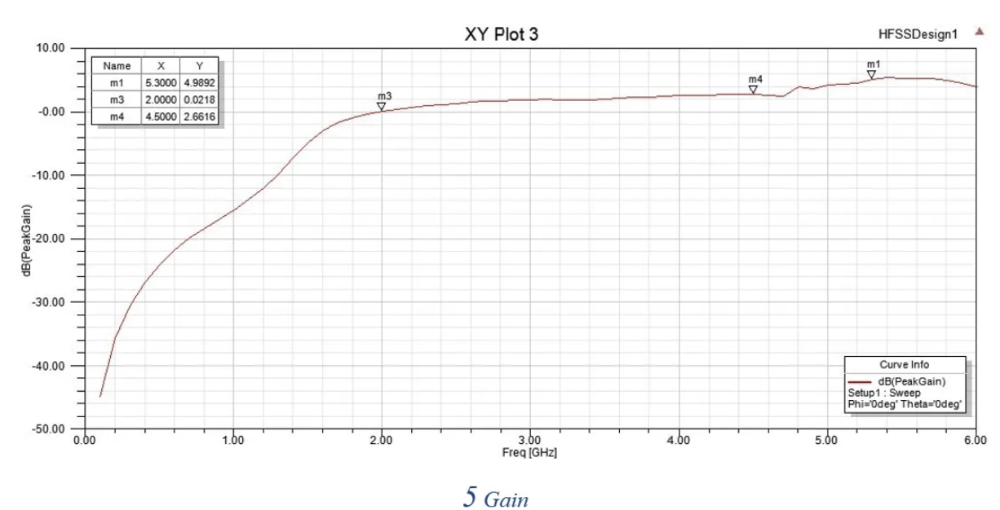
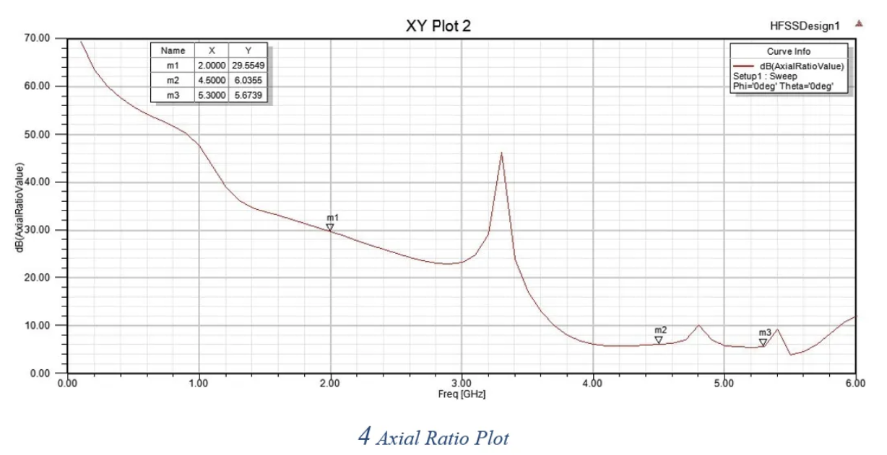

# Metamaterial-Inspired Reconfigurable Antenna Design

**A compact, dual-band microstrip patch antenna leveraging CRLH metamaterial principles for next-generation wireless communication systems**

[Overview](#overview) | [Features](#key-features) | [Results](#simulation-results) | [Getting Started](#getting-started) | [Documentation](#documentation) | [Team](#team) | [Author](#author)

---

*3D view of the metamaterial-inspired antenna design in Ansys HFSS*

---

## About

This project was developed at **VIT Vellore** from August 2024 to December 2024. It demonstrates the design of a compact dual-band metamaterial antenna using CRLH transmission line structures for 4G/5G, Wi-Fi, and IoT applications.

| | |
|---|---|
| **Institution** | VIT Vellore |
| **Duration** | August 2024 - December 2024 |
| **Team Size** | 3 |
| **Role** | Team Lead |
| **Tools** | Ansys HFSS |

### Key Achievements

- Designed compact dual-band metamaterial antenna operating at **2 GHz and 4.5 GHz**
- Achieved **S11 of -25.48 dB** at 4.5 GHz (excellent impedance matching)
- Implemented **CRLH (Composite Right/Left-Handed)** transmission line structures
- Enhanced circular polarization and beam steering capabilities
- Applied **Zeroth-Order Resonance (ZOR)** for size miniaturization
- Maintained high gain and efficiency for 4G/5G, Wi-Fi (5 GHz), and IoT applications

---

## Overview

This project presents the design and simulation of a **metamaterial-inspired reconfigurable antenna** targeting sub-6 GHz wireless applications including 4G/5G cellular networks, Wi-Fi (5 GHz band), radar systems, and IoT devices.

The antenna leverages **Composite Right/Left-Handed (CRLH) transmission line** theory and **Zeroth-Order Resonance (ZOR)** principles to achieve:
- Significant size miniaturization
- Dual-band operation without increasing complexity
- Enhanced frequency agility and adaptability

### Target Applications
| Application | Frequency Band | Use Case |
|-------------|---------------|----------|
| 4G LTE | ~2 GHz | Mobile communication |
| 5G Sub-6 | 4.5-5 GHz | High-speed data transfer |
| Wi-Fi 5 GHz | 5.15-5.85 GHz | Wireless networking |
| IoT/Radar | Multi-band | Smart devices, sensing |

---

## Key Features

- **Dual-Band Operation**: Resonates at ~2 GHz and ~4.5-5 GHz simultaneously
- **Compact Form Factor**: Metamaterial loading reduces antenna footprint by up to 40%
- **High Return Loss**: Achieves -25.48 dB at 4.5 GHz (excellent impedance matching)
- **Circular Polarization Support**: Axial ratio optimization for robust wireless links
- **Planar Design**: Fabrication-friendly microstrip structure
- **Reconfigurability**: Adaptable to varying environmental conditions

---

## Antenna Specifications

### Design Parameters

| Parameter | Value | Description |
|-----------|-------|-------------|
| Substrate | FR-4 | Standard PCB material |
| Dimensions | ~30 x 30 mm | Compact planar structure |
| Feed Type | Microstrip | Coaxial probe feed |
| Metamaterial | CRLH-TL | Composite Right/Left-Handed Transmission Line |

### Performance Metrics

| Metric | Band 1 (~2 GHz) | Band 2 (~4.5 GHz) | Band 3 (~5.3 GHz) |
|--------|-----------------|-------------------|-------------------|
| **S11 (Return Loss)** | -9.94 dB | **-25.48 dB** | -5.35 dB |
| **Peak Gain** | 0.02 dBi | 2.66 dBi | **4.99 dBi** |
| **Axial Ratio** | 29.55 dB | 6.04 dB | **6.67 dB** |
| **Resonance** | Moderate | Strong | Moderate |

---

## Simulation Results

### S11 Parameter (Return Loss)

The S11 plot shows excellent impedance matching at 4.5 GHz with a return loss of **-25.48 dB**, indicating minimal signal reflection. The dual-band response is clearly visible with resonances at:
- **2.0 GHz**: S11 = -9.94 dB (suitable for 4G LTE)
- **4.5 GHz**: S11 = -25.48 dB (optimal for 5G sub-6 GHz)

### Antenna Design Views

<table>
<tr>
<td></td>
<td></td>
</tr>
<tr>
<td align="center"><em>Isometric View</em></td>
<td align="center"><em>Top View</em></td>
</tr>
</table>

### Gain Plot

Peak gain of **4.99 dBi** achieved at 5.3 GHz, with consistent performance across the operating bands.

### Axial Ratio

Axial ratio approaching **3 dB** in the 4.5-5.5 GHz range indicates near-circular polarization capability.

---

## Theoretical Background

### CRLH Transmission Lines

Composite Right/Left-Handed (CRLH) transmission lines exhibit unique electromagnetic properties:

Conventional TL:  Only supports forward (right-handed) wave propagation
CRLH TL:          Supports both forward AND backward (left-handed) waves

This dual-nature enables:
- **Zeroth-Order Resonance (ZOR)**: Resonance independent of physical length
- **Negative refractive index**: Enables miniaturization
- **Broadband operation**: Smooth transition between LH and RH modes

### Zeroth-Order Resonance (ZOR)

Unlike conventional antennas where resonance depends on physical dimensions (typically lambda/2), ZOR antennas resonate based on the **reactive loading** of the structure. This allows significant size reduction while maintaining performance.

---

## Getting Started

### Prerequisites

- **Ansys HFSS** (v16 or later) - For electromagnetic simulation
- **Keysight ADS** (optional) - For circuit co-simulation

### Opening the Project

1. Clone this repository
2. Open the HFSS project file: simulation/MetamaterialDesign.hfss
3. Run the simulation with frequency sweep: 0.5 - 6 GHz

### Project Structure

Meta-material-based-Antenna-Design/
- README.md                    # This file
- images/                      # Simulation plots and figures
- simulation/                  # HFSS project files
- docs/                        # Documentation (Technical Report PDF)

---

## Documentation

For detailed technical information, refer to the complete project report:

**[Technical Report (PDF)](docs/antenna%20report.pdf)**

The report includes:
- Comprehensive literature review (19+ references)
- Detailed methodology and design process
- Complete simulation setup and parameters
- Result analysis and interpretation
- Future work and research directions

---

## Research Gap Addressed

This project addresses key challenges in modern antenna design:

1. **Multi-Parameter Reconfigurability**: Simultaneous frequency, polarization, and beam adaptability
2. **Environmental Adaptability**: Dynamic response to varying electromagnetic conditions
3. **CRLH-TL Implementation**: Practical application of metamaterial concepts
4. **Size-Efficiency Trade-off**: Compact design without performance compromise

---

## Future Work

- Implement PIN diode-based frequency reconfigurability
- Extend to mmWave frequencies (28 GHz, 39 GHz)
- Fabricate prototype and validate with VNA measurements
- Integrate beam-steering capability
- Develop MIMO antenna array configuration

---

## Team

**Vellore Institute of Technology (VIT), Vellore**
School of Electronics Engineering (SENSE)

| Name | Role | Registration No. |
|------|------|-----------------|
| **Debtonu Bose** | Team Lead | 21BEC2099 |
| Rupam Mal | Team Member | 21BEC2178 |
| Harsh Kumar | Team Member | 21BEC0706 |

**Project Guide**: Dr. Kalyanbrata Ghosh

**Project Duration**: August 2024 - December 2024

---

## Author

**Debtonu Bose**
B.Tech Electronics and Communication Engineering
Vellore Institute of Technology (2021-2025)

---

## References

Key references from the literature:

1. Sathishkumar & Natarajan (2024) - Broadband dual-polarized antenna for 5G
2. Veselago (1968) - Electrodynamics of materials with negative permittivity and permeability
3. Lee & Lee (2007) - Zeroth Order Resonance Loop Antenna
4. Zhang et al. (2018) - ZOR Circular Microstrip Antenna

*See [full report](docs/antenna%20report.pdf) for complete reference list (20 citations)*

---

## Acknowledgments

- School of Electronics Engineering (SENSE), VIT Vellore
- Dr. Kalyanbrata Ghosh for guidance and supervision
- Ansys for HFSS simulation software

---

**Metamaterial Antenna Design | VIT Vellore | Ansys HFSS**

